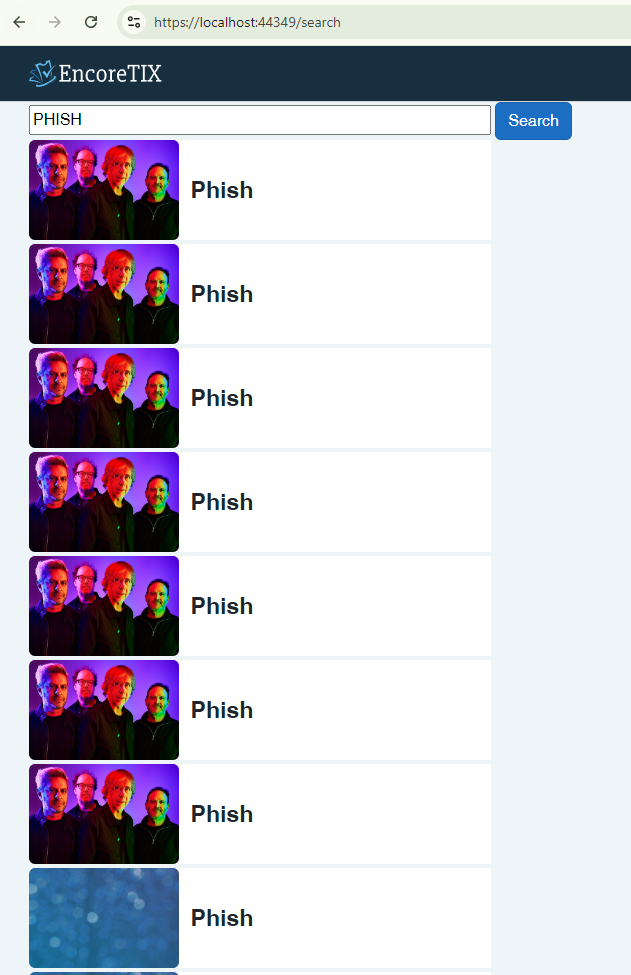

# Backend Developer Exam for Team Dev 360

This a web application using **Blazor** running under **.Net 8.0**

# Running the project
Make sure you have .Net 8.0 as a Target Framework and Visual Studio to run the project.

# Architecture and Design Pattern

 - CQRS (Command Query Responsibility Segregation) pattern using MediatR
 - Dependency Injection
 - Service Pattern

# Screenshots

